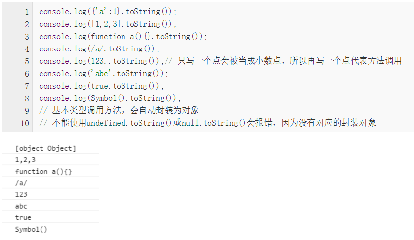

## 闭包的用途，换句话说是什么时候需要使用闭包
1. 可以读取函数的内部变量
2. 可以让这些变量的值始终保存在内存中
注意：立即执行函数中定义函数也是闭包，立即执行函数封装了一个作用域，将参数传递
进去就相当于传值，内部定义的函数引用了，就会使这些变量保存在内存中
```javascript
var arr = []
for(var i=0;i<=3;i++){
   arr[i] = (function (j){
    console.log(j)
   })(i)
}
```
[连接地址]{http://www.ruanyifeng.com/blog/2009/08/learning_javascript_closures.html}

## 媒体查询的总结
响应式设计的核心是媒体查询
1. 设置Meta标签
```html
<meta name="viewport" content="width=device-width,initial-scale=1.0,maximum-scale=1.0,user-scalable=no">
//width = device-width: 宽度等于当前设备的宽度
//initial-scale: 初始的缩放比例（默认值设置为1.0）
//minimum-scale/maximum-scale: 允许用户缩放的最小和最大的比例
//user-scalable: 是否允许手动缩放
```
2. 加载兼容文件js
因为ie8既不支持html5，也不支持css3 Media,所以需要加载两个文件
```
<!--[if it IE 9]>
<script src = "https://oss.maxcdn.com/libs/html5shiv/3.7.0/html5shiv.js"></script>
<script src = "https://oss.maxcdn.com/libs/response.js/1.3.0/respond.min.js"></script>
<![endif]-->
```
3. 设置ie的渲染方式默认为最高【换句话说，ie9的就不要使用ie8的渲染方式了】（可选）
```html
<meta http-equiv="X-UA-Compatible" content="IE=edge">
//建议使用
<meta http-equiv="X-UA-Compatible" content="IE=Edge,chrome=1">
//chrome=1:如果用户电脑中装了chrome插件，就可以让电脑中的ie不管是哪个版本都可以使用webkit引擎以及v8引擎来运算
```

4. media的写法
第一种，直接在link标签中的Media属性
第二种，在css中的条件中写
5. media所有参数
width/height/device-width/device-height/orientation/color/aspect-ratio/device-aspect-ratio/color-index/grid/resolution/monochrome

## 响应式布局的几种方式
- 媒体查询 Media css
- bootstrap的栅格布局
- flex的弹性盒子模型

## 响应式的图片
1. 最常用的矢量图；矢量图是图形，通过数学公式画出来的，放大和缩小不失真；图像一般是拍摄出来的，缩放比例不是100%，从某种程度上是失真
2. img标签，图片随着容器自动放缩，保持宽高比，max-width:100%;
3. 背景图片，background-size:contain【没有裁切】,background-size:cover【可能有裁切】
4. 设置固定的高宽比，有利于适应不同的屏幕，如轮播图组，可以通过padding和margin的放缩，建议使用百分比【相对于父容器的width】
```css
.test{
    height:0;
    padding-top:50%;
    background: red;
}
```

## 响应式布局的字体
rem

## html5的API
1. 语义化
- html5的节段和提纲：section,article,nav,header,footer,aside,hgroup,figure标签
- 音视频：audio，video
- 表单和兼容性解释器
2. 通信
- websocket全双工通信
3. 离线存储
- indexDB,浏览器端的数据库，存储大量结构化数据，并且能够在这些数据上使用索引进行高性能检索
- localStorage，键值对存储数据，js操作进行操作和销毁的对象
- sessionStorage,也是键值对存储的方式，针对一个seesion的数据存储（关闭窗口，存数数据清空）
```javascript
//用户在一个列表页浏览时，点击一个列表进入详情，返回要求记录用户刚刚浏览过的位置，而不是重
新刷新页面回到了页面顶部：页面滚动---将滚动的位置存储到sessionStorage中---再次进入到页面中，到seesion
中取出上次保存的浏览位置---滚动到对应位置
//滚动时保存滚动的位置
$(window).scroll(function(){
    if($(document).scrollTop() != 0){
        sessionStorage.setItem("offsetTop",$(window).scrollTop())
    }
})
//onload的时候，取出并滚动到上次保存的位置
window.onload = function(){
    var _offset = sessionStorage.getItem("offsetTop")
    $(document).scrollTop(offsetTop)
}
```
4. 多媒体
- audio和video
5. 图像和3D
- canvas和webGL
6. 性能
- web worker
- XMLHttpRequest2
- history API
- contentEditable 富文本操作
- drag和drop 拖拽
- 动画 requestAnimationFrame
7. 设备访问
- 检测设备方向
- 使用地理位置

## 理解BOM和DOM
1. BOM: 浏览器对象模型(browser)，BOM提供了很多对象，用于访问浏览器功能，核心对象是window
2. DOM: 文档对象模型(documnet),是针对html和xml文档的一个API（应用程序编程接口），DOM描绘了一个层次化的
节点树，允许开发人员添加和移除和修改页面的某一个部分
补充：
- 最基本的节点类型是Node,用于抽象的表示文档中一个独立的部分；所有其他类型都是继承自Node
- document类型表示整个文档，是一组分层节点的根节点，在javascript中，document对象是Document的一个实例
- element节点表示文档中所有html和xml元素，可以用来操作这些元素的类容和特性

## js对象中的属性
js中的对象定义三种类型的属性：私有属性、实例属性、类属性，私有属性只能在对象内部使用，实例属性必须通过对象的
实例进行引用，而类属性可以直接通过类名进行引用。属性的创建、读取、遍历、检测
1. js中属性的定义
- 属性名称可以包含英文字母、数字（不能开头）、特殊符号（-、_、$等）
- 若属性名称包含-（横杠），属性访问方式只能采用"[]"中括号访问
```
var obj = {
    x: 1,
    "-y": 2
}
console.log(obj['-y'])
```
2. 属性的分类
- 私有属性：私有属性只能在构造函数内部定义与使用,有点局部变量的意思
```
function User(age){
    this.age = age
    var isChild = age < 12
    this.isLittleChild = isChild
}

var user = new User(15)
alert(user.isLittleChild) //正确的方式
alert(user.isChild)  //报错，对象不支持此属性或者方法
```
- 实例属性：prototype方式，格式functionName.prototype.propertyName = value;
this方式，格式：this.propertyName = value
```
function User(){}
User.prototype.name = "user1"
User.prototype.age = 18
var user = new User()
alert(user.age)

function User(name,age){
    this.name = name
    this.age = age
}
var user = new User("afda",12)
alert(user.age)
```
- 类属性：functionName.propertyName = value
```
function User(){}
User.MAX_AGE = 200
User.MIN_AGE = 0
alert(User.MAX_AGE)
```
总结：只有实例属性才可以被继承，但是继承不会改变原型上的属性值
3. 属性的访问方式
- "."访问方式，属性名必须是一个标识符（静态字符串），不能为变量
```
var obj = {}
obj.x = 1
```
- '[]'中括号的方式，属性名可以是一个静态字符串，也可以是一个变量
```
var obj = {
    x: 1,
    y: 2
}
var a = "y"
console.log(obj[a]) //2
```
4. 对象的属性删除
语法： delete obj.propertyName 或者 delete obj[propertyName]
说明：delete只能删除对象的自有属性，不能删除继承属性
5. 属性检测
- in运算符
```
function People(name){
    this.name = name
}

function Student(age){
    this.age = age
}

Student.prototype = new People()
var s = new Student(20)

console.log('age' in s) //true:age为实例属性
console.log('name' in s) //true：name为继承属性
```
- obj.hasOwnProperty(propertyName):判断对象是否拥有一个指定名称的实例属性
```
var Student = function (name){
    this.name = name
}
Student.prototype.sayHello = function (){
    alert(this.name)
}
Student.prototype.age = ''
var st = new Student("ahnsjfhds")
console.log(st.hasOwnProperty('name')) //true
console.log(st.hasOwnProperty('sayHello')) //false：原型上的方法
console.log(st.hasOwnProperty('age')) //false：原型上的属性
```
- obj.propertyIsEnumerable(propertyName): 判断指定属性是否是实例属性并且可以枚举的
```
var obj = Object.create({},{
    name: {
        value: 'tom',
        enumerable: true
    },
    age: {
        value: 22,
        enumerable: false
    }
})

console.log(obj.propertyIsEnumerable('name')) //true
console.log(obj.propertyIsEnumerable('age')) //false

console.log(obj.hasOwnProperty('age'))  //true
```
6. 属性遍历
- for in
```
var po = {px: 2}
var o = {x: 3}
o.__proto__ = po
for(var p in o){
    console.log(p) //px,x
}
```
- Object.keys(obj):返回数组，包含对象可枚举的实例属性名称
```
var op = {px: 2}
var o = {x: 3}
o.__proto__ = op
var arr = Object.keys(o) // [x]
```
- Object.getOwnPropertyNames(obj): 返回数组，包含对象的所有实例属性名称，包括枚举和不可枚举的
```
var op = {px: 2}
var o = {x: 3,y: 4}
o.__proto__ = op
Object.defineProperties(o,{
    x:{
        enumerable: true
    },
    y:{
        enumrable: false
    }
})
var arr1 = Object.keys(o) // [x]
var arr2 = Object.getOwnPropertyNames(o) //[x,y]
```

## css中的动画vs过度
1. 过度transition: 过度是从一个状态到另一个状态，需要事件触发这个状态的变化，对应的属性指的是固有属性，如宽高、透明度等
2. 动画animation: 动画是在一个声明中设置多个状态，例如在百分之多少的时候，重点是结合@keyframes自定义属性，完成比较复杂的动画

## web Worker,service Worker,webSocket的对比
1. web Workers可以让js运行到后台，来解决js线程可能会冻结页面的问题，我们可以将大量数据的处理交给workers来做，只将页面渲染事情
交给js就好了；现在基本有三种worker: Worker(dedicated worker)、sharedWorker和service Worker
```
var myWorker = new Worker('need.js')
myWorker.postMessage("") //这句话是用来启动worker的，说的worker不接受到信息是不会触发的
```
传的数据都支持字符串，自safari4之后都支持json格式。所以json也都是可以使用的。注意，这些数据的传输都是拷贝赋值的，而不是共享的执行环境
相互之间都是通过postMessage和onmessage来通信的
```
//主线程
var myWorker = new Worker('worker.js')
myWorker.onmessage = function(oEvent){
    console.log(oEvent.data)
}
myWorker.postMessage("从主线程来的")
//worker.js的内部
onmessage = function(oEvent){
    postMessage("worker的数据1")
}
```
停止worker的工作：myWorker.termiate();worker也可以自杀: self.close()
worker与主页面所执行的js完全在不一样的作用域内，并不共用作用域。注意：webWorker代码不能访问dom，也无法任何方式影响外观，特点如下：
- 全局对象就是Worker对象本身，就是self和this都指向Worker对象
- 最小化的navigator对象，有online,appName,appVersion,userAgent,platFrom属性
- 只读的location
- settimeout,setInterval,cleartimeout,clearinterval
- XMLHttpRequest构造函数
所以，Worker的运行环境与页面相比，功能是相当有限的
2. service worker为离线缓存而生，类似与app的服务，与浏览器的缓存不是一回事
html5提出的service Worker，基于web Worker，可以说是web Worker的一种，他是一段运行在浏览器后台进程里的脚本，它独立于当前页面，提供了那些不需要与
web页面交互的功能在网页背后悄悄执行的能力，在将来，基于它可以实现消息推送，静默更新以及地理围栏等服务，但目前它首先要具备的功能是拦截和处理网络请求，
包括可编程的响应缓存管理，所以他可以在断网情况下轻松实现拦截用户请求，用已经缓存的页面
代替服务器响应，简称离线缓存。
注意：service Worker由于权限很高，只支持https协议或者localhost
service worker的生命周期：
- 安装
- 激活，激活成功后，打开chrome://inspect/#service-workers可以查看当前运行的service Worker
- 监听fetch和Message事件
    - fetch事件：在页面发起http请求时，service Worker可以通过fetch事件拦截请求，并且给出自己的响应。w3c提供了一个新的fetch api，用于取代XMLHttpRequest，
    与xhr最大的不同有：1.fetch返回的是promise对象，通过then方法进行连续调试，减少嵌套。es6的promise称为标准之后，会越来越方便开发人员；2.提供request和response对象，
    前端要发起请求可以通过url发起，也可以使用request对象发起，而request可以复用。但是response用在哪里呢？在service Worker出现之前，前端确实不会自己给自己发消息，但是
    有了service Worker，就可以在拦截请求之后根据自己做出响应，对页面而言，这和普通的请求没有区别
    - message事件：页面和service Worker之间可以通过postMessage()发送消息，发送的消息可以通过message事件接收到，这是一个双向的过程，页面可以发消息给service Worker，service Worker也
    可以发送消息给页面，由于这个特性，可以将service Worker作为中间纽带，使得一个域名或者子域名下的多个页面可以自有通信
    - install事件：当页面加载时触发该事件。常用于缓存离线页面，当断开网络时，在该事件中缓存的页面将返回给用户
    - acrive事件：当service Worker被触发时触发该事件。代码更新后，通常需要在activate的callback中执行一个管理cache的操作。因为你会需要清除掉之前旧的数据。我们在activate而不是install的时候
    执行这个操作是因为如果我们在install的时候立马执行它，那么依然在运行的旧版本的数据就坏了
- 销毁，是否销毁由浏览器决定，如果一个service Worker长期不使用或者机器内存有限，则可能销毁这个Worker
cache storage：作为service Worker的一部分写在草案中，通过它我们可以方便地把请求以及请求结果一同缓存起来
```
//先判断这个请求是否已经被缓存过了，缓存过了就直接返回结果，没有的话就去请求，并把结果添加到缓存中，以便下次请求来时可以直接返回
service-worker.js
const handleFetchRequest = function(request){
    return catch.match(request)
    .then(function(response){
        return response || fetch(request).then(function(response){
            const clonedResponse = reponse.clone()

            caches.open(CACHE_NAME).then(function(cache){
                cache.put(request,cloneResponse)
            })

            return response
        })
    })
}
```
使用cache storage的时候还需要注意以下几点：
- 它只能缓存get请求
- 每个站点只能缓存属于自己域下的请求，同时也能缓存跨域的请求，比如cdn，不过无法对跨域请求的请求头和内容进行修改
- 缓存的更新需要自行实现
- 缓存不会过期，除非将缓存删除，而浏览器对每个网站cache storage的大小有硬性限制，所以需要清理不必要的缓存
上面的代码并没有做缓存的清除和更新，所以还要更新以下，同时给跨域请求添加{mode:'cors'}属性来使请求支持跨域，从而拿到响应
头信息
```
 const HOST_NAME = location.host
 const VERSION_NAME = 'CACHE-v1'
 const CACHE_NAME = HOST_NAME + '-' + VERSION_NAME
 const CACHE_HOST = [HOST_NAME,"cdn.bootcss.com"]

 const isNeedCache = function(url){
    return CACHE_HOST.some(function(host){
        return url.search(host !== -1
    })
 }

 const isCROSRequest = function(url,host){
    return url.search(host) === -1
 }

 const isValidResponse = function(response){
    return response && response.status >= 200 && response.status < 400
 }

 const handleFetchRequest = function(req){
    if(isNeedCache(req.url)){
        const request = isCROSRequest(req.url,HOST_NAME) ? new Request(req.url,{mode:'cors'})
        return caches.match(request).then(function(response){
            if(response){
                fetch(request).then(function(response){
                    if(isValidResponse(response)){
                        caches.open(CACHE_NAME).then(function(cache){
                            cache.put(request,response)
                        })
                    }
                })
            }else{
                sentMessage('update cache' + request.url + ' fail: ' + response.message)
            }
        })catch(function(err){
            sentMessage('Update cache' + request.url + " fail: " + err.message)
        })
    }
    return response
 }
 ```
 具体的代码地址：[链接地址]{https://segmentfault.com/a/1190000008491458}
 [链接地址]{http://blog.csdn.net/qiqingjin/article/details/51629278}

## 理解object与Object的区别
typeof的结果是字符串，检查数据类型，结果有undefined,object,boolean,string,number,function;
Object是对象类型，换句话说是关键字，"object"是一个字符串，不定义就没有意义，判断是否是Object
的实例，用instanceof,instanceof Object
Array,Boolean,Date,Error,Function,Number等都属于对象；
Object的toString方法是将对象转化成字符串
```
var t = false
console.log(typeof t) //boolean
c = t.toString()
console.log(typeof c) //string
```
## javascript类型检查与内部属性[[class]]
所有对象都包含一个内部属性[[class]],我们不能直接访问这个属性，但是可以通过
Object.prototype.toString.call(...),这也是比较靠谱的检查类型的方法(instanceof\constructor等)
比如检测一个数组
```
Object.prototype.toString.call([1,2,3]) //[object Array]
//这里的Array实际上就是调用了原生函数Array()内部的[[Class]]属性，我们可以封装一个检测类型的函数
function classOf(obj){
    return Object.prototype.toString.call(obj).slice(8,-1)
}
```
javascript为基本类型值包装了一个封装对象，使他们变成对象，而String()\Number()\Boolean()上有属性[[Calss]],
这里的undefined、null没有对应的原生函数，但仍然有内部属性返回
- 为什么要用Object.prototype.toString.call(),而不是直接使用toString()呢？

可以看到只有普通对象返回我们想要的，这是因为普通对象直接调用了顶级原型Object上的toString方法，
而数组、函数以及这些基本包装对象它们继承了Object的同时，重写了方法，在查找toString方法的时候，
一定是自己原型链上的方法优先被找到，所以我们就需要利用call调用顶级原型Object.prototype上的toString方法

## Array.isArray(Array.prototype) //true vs Array.prototype instanceof Array //false
1. instanceof
- 首先instanceof的判断方法是：左侧的原型链中的各个[[prototype]]指针是否指向Array.prototype(即右侧对象的原型)，
如果有则返回true，Array.prototype.__proto__ === Object.prototype,所以instanceof是错误的
```
function instance_of(L,R){
    var O = R.prototype
    L = L.__proto__

    while(true){
        if(L === null){
            return false
        }
        if(O === L){
            return true
        }

        L = L.__proto__
    }
}
```
2.Array.isArray
- 如果传入的参数不是Object，返回false
- 如果内部属性[[Class]]是Array（通过Object.prototype.toString.call(...).splice(8)）,返回true
- 其他情况都是返回false

## 从eventloop理解异步
[参考大神]{http://www.zhimengzhe.com/HTMLjiaocheng/294401.html}
[参考连接]{https://segmentfault.com/a/1190000008299659}

## js正则表达式的总结
1. 定义正则对象
    - 构造函数的方式
    ```
    var reg = new RegExp("abc","gi")
    ```
    - 字面量的方式
    ```
    var reg = /abc/gi
    ```
2. 属性
    - global 布尔 表示正则是否全局匹配
    - ignoreCase 布尔 表示是否忽略大小写
    - lastIndex Number 表示上次匹配成功的位置
    - mutiline 布尔 表示是否多行匹配
    - source  String 表示正则的类容
3. 方法
    - reg.test() 参数为String，返回值为boolean，表示是否匹配
    ```
    var reg = /boys(s)?\s+and\s+girls(s)?/gi
    console.log(reg.test("boy and girl"))
    ```
    - reg.compile() 参数是正则表达式，无返回值，对正则表达式进行编译，被编译过的正则表达式在使用的时候效率更高；适用于一个正则多次被使用的情况
    ```
    var reg = /[abc]+/gi
    reg.compile(reg)
    console.log(reg.test("abc"))
    ```
    - reg.exec() 接受String，返回array，长度为1，从左向右一次匹配,有点类似迭代器
    ```
    //exec()每次返回的数组类容：第一个为整个匹配的字符串，第二个为reg中()所定义分组所匹配的字符串
    var reg = /../
    var str = "asfdasf"
    var arr = reg.exec(str)
    while(arr){
        console.log(arr)
        console.log(reg.lastIndex)
        arr = reg.exec(str)
    }

    //example and result
    var reg = /abc/gi
    var str = "12abc34abc567abc"
    var arr = reg.exec(str)
    while(arr){
    	console.log(arr)
    	console.log("last:" + reg.lastIndex)
    	arr = reg.exec(str)
    }
    VM12798:5 ["abc", index: 2, input: "12abc34abc567abc"]
    VM12798:6 last:5
    VM12798:5 ["abc", index: 7, input: "12abc34abc567abc"]
    VM12798:6 last:10
    VM12798:5 ["abc", index: 13, input: "12abc34abc567abc"]
    VM12798:6 last:16
    ```
   - String中有关正则的方法
        - search() 查找第一个匹配的位置，参数为正则，返回值为Number index
        ```
        var str = "afddasfa"
        console.log(str.search(/o/g))
        ```
        - replace() 匹配到的类容替换（第一个参数为正则或者子字符串，第二个参数为被替换类容,返回值为新的字符串）
        ```
        var str = "me hello me"
        console.log(str.replace(/me/g,"you")) // you hello you
        ```
        - split() 将字符串拆分成数组（接受正则或者子字符串）
        ```
        var str = "how|old are you"
        var arr = str.split("")
        ```
        - match() 返回匹配的数组（参数为正则）
        ```
        var tpl = "<p>hello,call me <%name%>,i am <%age%></p>"
        var reg = /<%([^%>]+)?%>/g
        var match = tpl.match(reg)
        console.log(match)
        match.forEach(function (value,index) {
            console.log("index:"+index+"is value:"+value)
        })
        ```
- 常见的正则匹配规则
    - ^ 匹配一个输入或者一行的开头
    - $ 结尾
    - * 0次或者多次
    - + 1次或者多次
    - ？ 0次或者1次
    - (x) 匹配x保存x在名为$1,$2...$9的变量中
    - x|y 匹配x或y
    - {n} 精确匹配n次 {n,}{n,m}
    - [xyz] xyz的子集
    - [^xyz] 不匹配任何一个
    - [\b] 退格符
    - \b 单词边界 \B 单词非边界
    - \d 数字 \D 非数字
    - \n 换行
    - \r 回车
    - \s 空白 \S 非空白
    - \w 可以组成单词的字符（数字、字母和下划线）[a-zA-Z0-9] \W 不可以组成单词的字符

## 事件处理中的this
[参考连接]{https://www.tianmaying.com/tutorial/javascript-event}
## 如何检查javascript变量的类型
- typeof
- instanceof
- constructor
- toString

## js内置对象Date
1. 获取当前时间
```
var currentDate = new Date() //Wed Sep 27 2017 15:11:36 GMT+0800 (中国标准时间

var current = Date.now() //1506496320194

//两者相互转化是通过getTime方法，单位是毫秒
var current = new Date()
console.log("gettime:"+current.getTime())
console.log(Date.now())
VM408:2 gettime:1506496853817
VM408:3 1506496853817
```
2. 创建date对象
```
var date1 = new Date(2013,7,27)
var date2 = new Date('2017/7/27')
```
3. 获取当前时间的年月日
```
var date = new Date()
var year = date.getFullYear()
var month = date.getMonth()
var day = date.getDate()
```
4. 如何计算两个时间差(单位是毫秒msec)【用于倒计时计算】
```
var now = Date.now()
var target = new Date("2017/9/25")
target = target.getTime()
console.log(target - now)
```

## javascript函数的节流和防抖
    - 节流(throttle)和防抖(debounce)都是用来控制某个函数在一定的时间内执行多少次，区别在于throttle保证在一定的时间内必须执行一次
    1. debounce把非常频繁的事件（比如按键）合并成一次执行，比如搜索的精准匹配
    2. throttle保证每X毫秒恒定的执行次数，比如每次200ms检查滚动的位置，并触发css动画
```
n=0;
    //节流函数
    function throttle(method,context) {
        clearTimeout(method.tId)
        method.tId = setTimeout(function () {
            method.call(context)
        },100)
    }

    function resizehandler() {
        console.log(new Date().getTime())
        console.log(++n)
    }

    window.onresize = function () {
        throttle(resizehandler,window)
    }

    //改进版节流函数，到达固定间隔必须执行(在函数节流的基础上间隔固定时间就执行一次)
    function throttle(method,delay,duration){
                var timer=null, begin=new Date();
                return function(){
                    var context=this, args=arguments, current=new Date();;
                    clearTimeout(timer);
                    if(current-begin>=duration){
                         method.apply(context,args);
                         begin=current;
                    }else{
                        timer=setTimeout(function(){
                            method.apply(context,args);
                        },delay);
                    }
                }
    }
```
## 理解js的线程
1. 浏览器是多线程的:js线程、UI渲染线程、js事件（eventloop线程）；其中js是用来获取并且操作dom的，UI是用来渲染dom元素的，所以js线程与UI线程是互斥的，js执行的时候会阻塞dom的渲染
2. 以亲生经历为例：
    - ajax搭配自己写的loading效果（后台获取事件比较长，所以在页面显示刷新等待的gif图），初始的代码如下，但是效果没有显示出来，原因是：使用
    同步的ajax，会阻塞UI渲染线程，所以没有显示loading的效果
    ```
    $.shadow("")
    $.ajax({
        ...,
        aysnc: false,//同步
    })
    $.hideShadow()
    ```
    - 该进方法：使用setTimeout()将ajax请求放入下个事件循环，具体代码如下，结果：显示了loading，但是gif图片不动
    ```
    $.shadow("")
    setTimeout(function(){
        $.ajax({
            ...,
            aysnc: false,//同步
        })
        $.hideShadow()
    },0)
    ```
    - setTimeout()只是将同步ajax执行放入下个事件循环，所以UI线程会先渲染loading页面，但是执行同步ajax的时候，阻塞了UI，使得
    gif图无法动画；最终的解决方法是不要用ajax同步，改用异步，但是使用同步的写法(promise,jquery就配合$deffered)，以便数据可以为后面使用，具体代码如下:
    ```
    $.shadow("")
    function ajax(){
        var def = $.Deferred()
        $.ajax({
            ...,
            success: function(data){
                def.resolve(data)
            }
        })
        return def
    }
    $.when(ajax()).done(function(data){
        console.log(data)
        $.hideShadow()
    })
    ```

## 重写js的bind方法，使其支持ie8
```
if(!Function.prototype.bind){
    Function.prototype.bind = function(oThis){
        if(typeof this !== "function"){
            throw new TypeError("Function.prototype.bind error")
        }
        var aArgs = Array.prototype.slice.call(arguments,1)
        fToBind = this
        fNOP = function (){}
        fBound = function(){
            return fToBind.apply((this instanceof fNOP && oThis) ? this : oThis,aArgs.concat(Array.prototype.slice.call(arguments)))
        }
        fNOP.prototype = this.prototype
        fBound.prototype = new fNOP()
        return fBound
    }
}


//第二种写法
if(!Function.prototype.bind){
    Function.prototype.bind = function(){
        if(typeof this !== 'function'){
            throw new TypeError('Function.prototype.bind - what is trying to be bound is not callable')
        }
        var _this = this;
        var obj = arguments[0];
        var args = Array.prototype.slice.call(arguments,1);
        return function(){
            _this.apply(obj,ags)
        }
    }
}
```

## 如何判断浏览器的种类
```
function myBrowser(){
        var userAgent = navigator.userAgent; //取得浏览器的userAgent字符串
        var isOpera = userAgent.indexOf("Opera") > -1;
        if (isOpera) {
            return "Opera"
        }; //判断是否Opera浏览器
        if (userAgent.indexOf("Firefox") > -1) {
            return "FF";
        } //判断是否Firefox浏览器
        if (userAgent.indexOf("Chrome") > -1){
            return "Chrome";
        }
        if (userAgent.indexOf("Safari") > -1) {
            return "Safari";
        } //判断是否Safari浏览器
        if (userAgent.indexOf("compatible") > -1 && userAgent.indexOf("MSIE") > -1 && !isOpera) {
            return "IE";
        }; //判断是否IE浏览器
    }
```

## 如何清除或者禁用元素的点击事件
1. css3方法:  pointer-events属性(支持ie11)
```
.class{
    pointer-events: none;
}
```
2. js方法：
```
1.如果是js绑定
ele.onclick = function(){...}
//要清除的话，用空方法覆盖
ele.onclick = function(){}

2. jquery on方法绑定的点击事件
$ele.on("click",function(){})
$ele.off("click",function(){})

3.或者在点击事件的回调中判断状态（全局变量flag）
var flag = true
$ele.on("click",function(){
    if(flag){
    ...
    }
})

function toggle(){
    flag = !flag
}
```

## ajax请求状态及意义
在javascript里面写ajax的时，最关键的一步是对XMLHttpRequest对象建立监听，即使用“onreadystatechange”方法，
监听的时候，要对XMLHttpRequest对象的请求状态进行判断，通常是判断readyState的值为4且http返回状态status的值
为200或者304时执行我们需要的操作
readyState属性表示ajax请求的当前状态
```
0 代表未初始化。 还没有调用Open方法
1 代表正在加载。open方法已被调用，但森达方法还没有被调用
2 代表已加载完毕。send已被调用。请求已经开始
4 代表交互中。 服务器正在发送响应
5 代表完成。响应发送完毕
```

## promise的理解以及手动实现
```
待补充
```

## “||”与“&&”运算
1. "||"运算
只要"||"前面为false，不管后面是true还是false，都返回"||"后面的值
只要"||"前面为true，不管后面是true还是false，都返回"||"前面的值
2. "&&"运算
只要"&&"前面的值为false，不管后面是true还是false，都返回"&&"前面的值
只要"&&"前面的值为true，不管后面是true还是false，都返回"&&"后面的值

## 表单验证函数（策略模式）
具体的实现代码：
```
//表单验证
var validate = (function (arr) {
    //验证方法
    var ruleData = {
        /**
         * @description 不能为空
         * @param val
         * @param msg
         */
        isNoNull(val,msg){
            if(!val){
                return msg;
            }
        },
        /**
         * @description 最小长度
         * @param val
         * @param length
         * @param msg
         */
        minLength(val,length,msg){
            if(val.toString().length < length){
                return msg;
            }
        },
        /**
         * @description 最大长度
         * @param val
         * @param length
         * @param msg
         */
        maxLength(val,length,msg){
            if(val.toString().length > length){
                return msg;
            }
        },
        /**
         * @description 是否是手机号码格式
         * @param val
         * @param msg
         */
        isMobile(val,msg){
            if(!/^1[3-9]\d{9}$/.test(val)){
                return msg;
            }
        },
        /**
         * @description 是否全部是数字
         * @param val
         * @param msg
         */
        isNm(val,msg){
            if(!/^\d+$/.test(val)){
                return msg;
            }
        }
    }

    return {
        /**
         * @description 添加规则接口
         * @param type
         * @param fn
         */
        addRule: function (type,fn) {
            ruleData[type] = fn;
        },
        /**
         * @description 单个校验，第一个不符合校验就会抛出
         * @param arr
         */
        check: function (arr) {
            var ruleMsg,checkRule,_rule;
            for(var i=0,len1=arr.length;i<len1;i++){
                var item = arr[i],data = item.data,rules = item.rules;
                //如果字段找不到
                if (data === undefined){
                    return "字段找不到";
                }
                //遍历规则
                for(j=0,len2=rules.length;j<len2;j++){
                    var rule = rules[j].rule,msg = rules[j].msg;
                    //提取规则
                    checkRule = rule.split(":");//checkRule是检验函数的参数数组
                    _rule = checkRule.shift();
                    checkRule.unshift(data);
                    checkRule.shift(msg);
                    //如果规则有错误则返回错误
                    ruleMsg = ruleData[_rule].applay(null,checkRule);
                    if(ruleMsg){
                        return ruleMsg;
                    }
                }
            }
        },
        /**
         * @description 全部校验，所有校验完成了，统一返回信息列表
         * @param arr
         */
        checkAll: function (arr) {
            var ruleMsg,checkRule,_rule,msgArr=[];
            for(var i=0,len1=arr.length;i<len1;i++){
                var item = arr[i],data = item.data,rules = item.rules,alias = item.alias;
                //如果字段找不到
                if (data === undefined){
                    return "字段找不到";
                }
                //遍历规则
                for(j=0,len2=rules.length;j<len2;j++){
                    var rule = rules[j].rule,msg = rules[j].msg;
                    //提取规则
                    checkRule = rule.split(":");//checkRule是检验函数的参数数组
                    _rule = checkRule.shift();
                    checkRule.unshift(data);
                    checkRule.shift(msg);
                    //如果规则有错误则返回错误
                    ruleMsg = ruleData[_rule].applay(null,checkRule);
                    if(ruleMsg){
                        //记录错误信息
                        msgArr.push({
                            data: data,
                            alias: alias,
                            rules: _rule,
                            msg: ruleMsg
                        })
                    }
                }
            }
            //返回错误信息数组
            return msgArr.length > 0 ? msgArr : false;
        }
    }
})()

//test测试，在使用的时候，将需要检验的数据转化成如下的格式
validate.checkAll([
    {
        //校验数据
        data: 124444444,
        alias: 'mobile',
        //校验规则
        rules:[
            {rule: 'isNoNull',msg:"电话不能为空！"},
            {rule: 'isMobile',msg: '电话号码不合法，必须为11位数字！'}
        ]
    }
])
```

## Array与string混淆的处理方法
1. slice（数组）: 该方法是对数组进行部分截取，并返回一个副本；参数start是截取的开始数组索引，end是末尾索引
 用法：array.slice(start,end)
 slice(字符串): 与数组的用法一样
2. splice(数组): 从array中移除一个或多个数组，并用新的item替代它们。参数start是从数组array中移除元素的开始位置，参数deleteCount是要移除的元素的个数
 用法：array.splice(start,deleteCount,item...)
3. split(字符串)：将字符串改成字符串数组。参数limit可以限制被分割的片段数量。separator参数可以是一个字符串或者一个正则表达式
 用法：string.split(separator,limit)

## 数组中常用的方法（改变原数组和不改变原数组的方法）
1. 改变原数组的方法
shift: 将第一个元素删除并返回删除元素，空即为undefined
unshift: 向数组开头添加元素，并返回新的长度
pop: 删除最后一个并返回删除的元素
push: 向数组末尾添加元素，并返回新的长度
reverse: 颠倒数组顺序
sort: 对数组排序
splice: splice(start,length,item): 删，增，替换数组元素，返回被删除数组，无删除则不返回
2. 不改变原数组的方法，即返回新的数组
concat: 连接多个数组，返回新的数组
join: 将数组中所有元素以参数作为分隔符放入一个字符
slice: slice(start,end): 返回选定元素
map,filter,forEach,some,every: 等不改变原数组
3. 可以中断函数的循环，类似与break的作用  
every和some直到遇到return true或者数组结尾，才会退出循环


## js中间件的主框架实现
```$xslt
let mws = []
let spa = {
    add: function (mw) {
        if (typeof mw === 'function'){
            mws.push(mw)
        } 
    },
    dispatch: function (context) {
        let index = 0
        let next = function(){
            let mv = mws[index]
            index++
            if(mw){
                return mw(context,next)
            }
        }
        next()
    }
}
function middleware(context,next) {
    // ...
    // do next middleware
    next()
}

spa.add(middleware)
```

## js执行会阻塞dom树的解析和渲染，那么css加载会阻塞DOM树的解析和渲染吗？
- css加载不会阻塞dom树的解析
- css加载会阻塞dom树的渲染
- css加载会阻塞后面js语句的执行

因此：为了避免让用户看到长时间的白屏时间，我们应该尽可能提高css加载速度，有以下几种方法：
   - 使用CDN（因为CDN会根据你的网络状况，挑选最近的一个具有缓存内容的节点为你提供资源，因此可以减少加载时间）
   - 对css进行压缩（如打包工具webpack和gulp）
   - 合理的使用缓存(设置cache-control,expires,以及E-tag都是不错的，不过要注意一个问题，就是文件更新后，如何刷新缓存区文件，一个解决方案就是文件加上版本号)
   - 减少http请求（合并文件）