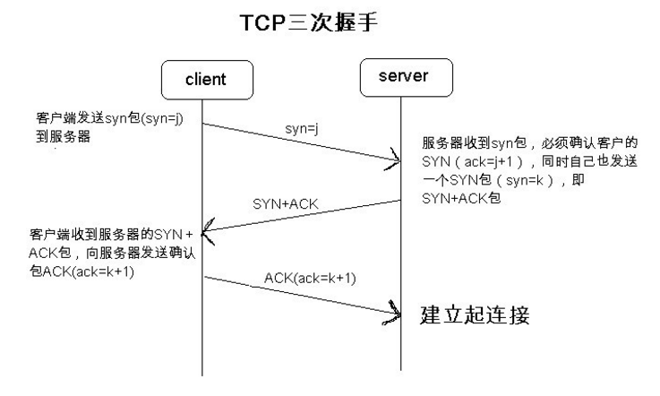

1. 先说一下tcp与udp的区别
tcp是面向连接的传输层协议，可以为应用层提供可靠的数据传输服务，所谓的面向连接不是真正意义上的连接，
只不过是在发送数据之前，首先得相互握手，也就是说对方知道你要发送数据给他了。而udp是面向无连接的传
输层协议，并不提供可靠的数据传输。udp传输是面向报文的，应用层交给UDP多长的报文，UDP就照样发送，一次
发送一个报文；TCP是面向字节流的，将数据分块，有缓冲区。恰当的比喻：udp传输类似于写信，接受方事先不知道必要写信给他，而tcp
是打电话，必须等待对方按了接听键你才能和他通话
DNS是依赖UDP的
2. udp传输
udp是一个比较简陋的传输层协议，只负责从发送端的应用层接受数据，封装udp报文段，然后交给下层发送到接受端；
在接收端，udp从下层接受数据，然后送达应用层。在该传输过程中，udp仅仅提供一个基本的差错检测服务，如果检
测没有错误，就直接交给应用层；否则直接丢弃
3. tcp如何保证数据传输的可靠性？
- 三次握手和四次挥手

为什么是三次而不是两次四次呢？
答：三次是实现安全连接理论的最小值，分析：只有一次，客户端--》服务器，说明客户端无法确定服务器是否收到了；
假如有两次，客户端---》服务器---》客户端，客户端知道了服务器收到信息了，但是服务器无法确定客户端是否接受到
信息；所以使用三次，客户端---》服务器---》客户端---》服务器，才能确保正常连接。
- 确认和重传机制
确认：报文段中的确认号，假设tcp从应用层收到3000个字节长度的数据，而tcp最大报文长度为1460，那么将数据分成三段
0-1459，1460-2919，2920-2999，确认号为0，1460，2920；假设服务器第一个收到的为0-1459，返回给客户端的ACK中确认
号为1460，然后服务器又收到2920-2999字节报文，但是未收到1460-2919，那么服务器端继续期望下一个接受字节为1460，
直到TCP确认值到第一个未收到字节之前的字节，所以tcp提供累积确认，换句话说，接收方保留失序字节，同时等待缺少的
字节来填补间隙
- 流量控制和拥塞机制
    - 流量控制：一个速度匹配服务，也就是说发送方发送数据的速率要与接收方应用程序读取速率相匹配，以消除接收方
    缓冲区溢出的可能性，在TCP的首部中有一个字段叫做接收窗口字段，它就是用来通知发送端服务器上剩余的缓冲区的
    大小（rwnd）
    - 拥塞机制：当丢包事件（要么出现超时，要么收到接受端的3个冗余的ACK）发生了，客户端就知道链路上存在拥塞；
    发送端维护着一个拥塞窗口(cwnd)，一个发送方的缓冲区中未被请求确认的数据量不会超过cwnd和rwnd（流量控制中
    接收窗口字段，服务器上剩余的缓冲区的大小）的最小值，这个约束限制了发送方未被确认的数据量，也就间接限制了
    发送速率
    其实TCP是按照如下原则来设置发送速率：
    1. 一个丢失的报文段意味着拥塞，因此当丢失报文段时应该降低TCP发送方的速率
    2. 一个确认报文段指示该网络正在向接收方交付发送方的报文段，所以，当对先前未确认报文段的确认到达时，能够增加
    发送方的速率
    3. 因为ip层并不向上层提供显示的网络拥塞反馈，所以TCP是通过ACK和丢包事件隐式信号进行带宽探测
- TCP跟踪一个拥塞窗口来(cwnd)提供拥塞控制服务，通过调节cwnd值以控制发送速率，那么TCP如何基于丢包事件来设置cwnd值？
通过TCP拥塞控制算法来实现。TCP拥塞控制算法主要有三个部分：慢启动、拥塞避免，快速回复
    - 慢启动
    - 拥塞避免
    - 快速恢复
[参考链接]{http://www.cnblogs.com/whc-uestc/p/4725671.html}
