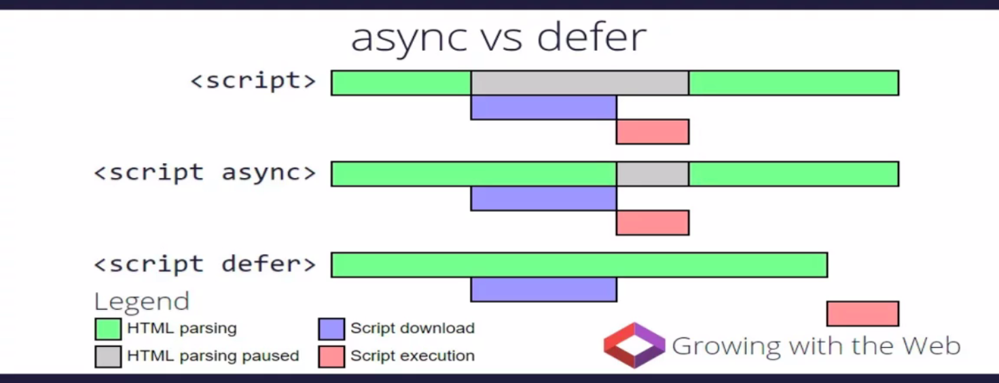
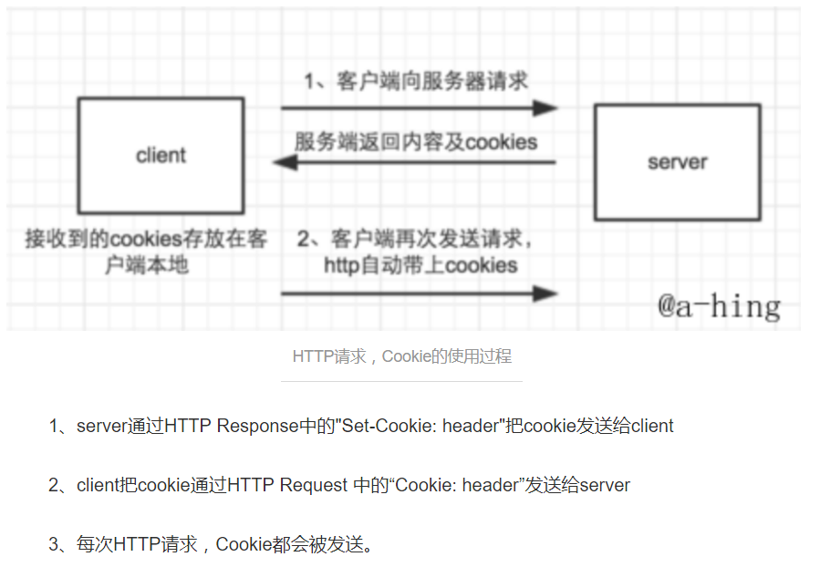

## 面试题
1. canvas上的图形可以使用诸如getElementById()之类的方法获得吗？如果不行该
怎么获取？
canvas是通过js绘制的图形，图形是一个个像素画上去的，不可以获取到；但是svg是
基于xml的格式，内部是一个个节点，可以用dom获取节点；canvas可以通过原生的
toDataURL()方法获取图像的Base64编码
2. ES6中的箭头函数可以用作构造函数吗？
不可以，因为箭头函数中没有绑定this，所以不可以使用new操作符调用
3. null和undefined区别？
null是一个表示无的对象，转化为数值时为0；undefined是一个表示“无”
的原始值，转化为数值时为NaN：
- 变量声明了，但是没有赋值时就等于undefined
- 函数调用时，应该提供的函数没有提供，为undefined
- 对象没有赋值的属性，该属性的值为undefined
- 函数没有返回值时，默认返回undefined
- null表示尚未存在的对象，常用来表示函数企图返回一个不存在的对象
- 对象原型链的终点是null
4. js延时加载的方式有哪些？
script的defer和async、动态创建dom（创建script，插入到dom中，加载完毕后callback）
按需异步加载js(requirejs\webpack)



5. 如何删除cookie？
设置cookie过期即可
6. 实现一个函数clone，可以对javascript的5种主要的数据类型（包括Number、String、Object
Array。Boolean）进行赋值
```javascript
Object.prototype.clone = function(){
    var o = this.constructor === Array ? [] : {}
    for(var e in this){
        o[e] = typeof this[e] === "object" ? this[e].clone() : this[e]
    }
    return o
 }
 ```
7. <strong>,<em>,<b>,<i>标签
strong和em是表达要素(phrase elements),都是用于强调文本，但是strong的强调程度更强一些
b和i是视觉要素，分别表示无意义的加粗和斜体
8. font阻塞内容渲染（@font-face）
- 浏览器为了避免FOUT(Flash of unstyle text),会尽量等待字体加载完成之后，再显示应用了该字体的
内容
- 只有当字体超过一段时间仍未加载成功时。浏览器才会降级使用系统的字体。每个浏览器都规定了自己
的超时时间
- 但是这也带来了FOIT(flash of invisible text)问题，类容无法尽快地被展示，导致空白
9. cookie的生命周期
可以通过setMAxAge()方法来设置cookie对象的有效时间，但是浏览器窗口关闭，cookie就会消失
10. http请求中cookies的使用
cookie的作用：cookie是用于维持服务器端会话状态的，通常由服务器端写入，在后续请求中，供服务器端读取

- http发送cookies的条件
    - 本地已经缓存有cookies
    - 根据url来匹配cookies的domain、path属性，如果符合才会发送，例如：访问www.baidu.com时，就不会发送www.qq.com的cookies
- 网站登录与App自动登录的原理
    - 用户在连接服务器时，服务器生成一个唯一的SessionID，而SeesionID这一个数据是保存在客户端，用Cooki额来保存，用户提交页面的
    时候，会将保存SeesionID的cookies提交到服务器进行验证
11. 顶级域名和子域名之间的cookies共享和相互修改、删除
- 设置cookie
    - 顶级域名只能设置domain为顶级域名，不能设置为二级域名或者三级域名，否则cookie无法生成
    ```
    //如yangbai.com能设置domain为yangbai.com或者www.yangbai.com，但是不能设置domain为login.yangbai.com，这样cookie不会生成
    setcookie("name1","yangbai",time() + 1000) //yangbai.com自己可以看到
    setcookie("name2","yangbai",time() + 1000,"/","www.yangbai.com") //.wwww.yangbai.com都可以看到
    setcookie("name3","yangbai",time() + 1000,"/","yangbai.com") //.yangbai.com都可以看到
    setcookie("name4","yangbai",time() + 1000,"/","login.youzan.com") //设置无效
    //设置domain的时候，.yangbai.com和yangbai.com是一样的
    //未指定domain时，默认的domain为用哪个域名访问就是哪个
    ```
    - 二级域名(以game.yangbai.com为例)
    ```
    setcookie("game","yangbai") //只有自己可以看到
    setcookie("game1","yangbai",time() + 1000,"/","yangbai.com") //*.yangbai.com都可以看到
    setcookie("game2","yangbai",time() + 1000,"/","chip.game.yangbai.com") //设置无效
    ```
- 读取cookie
    - 二级域名能读取设置了domain为顶级域名或者自生的cookie，不能读取其他二级域名domain的cookie。
    例如：想要cookie在多个二级域名中共享，需要设置domain为顶级域名，这样就可以在所有二级域名里面或者到这个cookie的值
    - 顶级域名只能获取到domain设置为顶级域名的cookie，domain设置为其他子级域名的无法获取
12. session依赖cookie，浏览器禁用了cookie怎么办？
- URL重写：response.encodeURL()对每个请求的URL处理，这个方法会自动追加sessionid，与手动添加的效果是一样的
13. 使用数组模拟一个循环链表
```
var arr = [10,11,12,13,14,15]
arr.unshift(arr.pop())
console.log(arr)
VM1789:3 (6) [15, 10, 11, 12, 13, 14]
var arr = [10,11,12,13,14,15]
arr.push(arr.shift())
console.log(arr)
VM1847:3 (6) [11, 12, 13, 14, 15, 10]
```
14. cookie的设置
cookie的参数：name 名称，key
value cookie的值
expire 过期时间，时间戳格式
path 服务器端有效路径，/表示整个域名有效，默认为当前设置cookie是页面的路径
domain 设置cookie有效的域名
secure 规定是否通过安全的https连接来传输cookie
```
//cookie操作
(function(){
    var cookieObj = {
        "add": function(name,value,hours){//修改或者添加cookie
            var expire = ""
            if(hours != null){
                expire = new Date((new Date()).getTime() + hours*3600000)
                expire = "; expires=" + expire.toGMTString()
            }
            document.cookie = name + "=" + escape(value) + expire + ";path=/"
            //如果指定域名可以使用如下
            //document.cookie = name + "=" + escape(value) + expire + ";path=/;domian = f"
        },
        "get": function(c_name){//读取cookie
            if(document.cookie.length > 0){
                c_start = document.cookie.indexOf(c_name + "=")
                if(c_start != -1){
                    c_start = c_start + c_name.length+1
                    c_end = document.cookie.indexOf(";",c_start)
                    if(c_end == -1){
                        c_end = document.cookie.length
                    }
                    return unescape(document.cookie.substring(c_start,c_end))
                }
            }
            return ""
        }
    }

    window.cookieObj = cookieObj
})()
```
